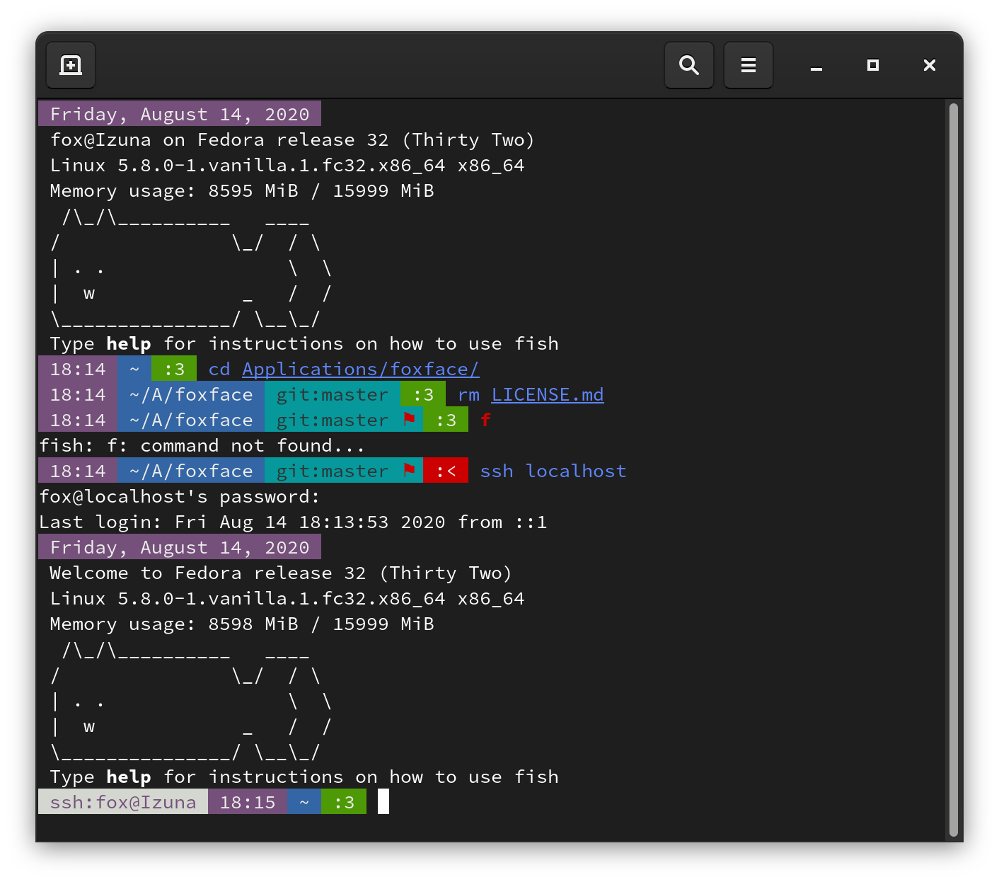

# foxfish



A theme for the friendly interactive shell (fish). Based on [ocean](https://github.com/oh-my-fish/theme-ocean) by Bruno Ferreira Pinto.

## Instructions

`config.fish` contains a simple template that makes use of the `foxfetch` command.

### [Fisher](https://github.com/jorgebucaran/fisher)

```
fisher add gitlab.com/n303p4/theme-foxfish
```

### [Oh My Fish](https://github.com/oh-my-fish/oh-my-fish)

```
omf repo add https://gitlab.com/n303p4/oh-my-fish
omf install foxfish
```

## foxfetch.fish

Requires fish 3.1 or higher.

This can be called with an optional `-w` or `--foxwhale` argument that prints an ASCII foxwhale.
